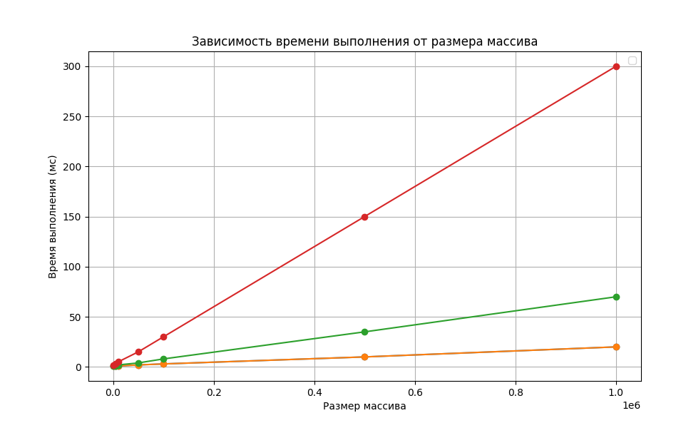

# Операции с числами на Java

[](https://github.com/ВАШ_ЛОГИН/ВАШ_РЕПОЗИТОРИЙ/actions/workflows/ci.yml)

Этот проект реализует базовые операции с числами: нахождение минимального, максимального значения, суммы и произведения чисел, прочитанных из файла.

## Описание функций
- `_min`: Нахождение минимального числа
- `_max`: Нахождение максимального числа
- `_sum`: Подсчет суммы всех чисел
- `_mult`: Подсчет произведения всех чисел

## Как запустить

1. Убедитесь, что у вас установлена JDK версии 11 или выше.
2. Склонируйте репозиторий:
    ```sh
    git clone https://github.com/ваш-логин-на-github/JavaNumberOperations.git
    ```
3. Перейдите в каталог проекта:
    ```sh
    cd JavaNumberOperations
    ```
4. Соберите проект и запустите программу:
    ```sh
    mvn clean install
    mvn exec:java -Dexec.mainClass="Main"
    ```

## Пример использования

В файле `numbers.txt` содержатся следующие числа:
1 2 3 4
Программа выведет:
Минимальное: 1
Максимальное: 4
Сумма: 10
Произведение: 24

## Описание файлов
- `Main.java`: Основной файл программы, который считывает числа из файла и выполняет операции.
- `MainTest.java`: Тесты для проверки корректности функций.
- `numbers.txt`: Пример файла с числами для обработки.
- `pom.xml`: Конфигурационный файл Maven.
- `.github/workflows/ci.yml`: Конфигурация GitHub Actions для CI/CD.

## График зависимости времени выполнения от кол-ва чисел в файле

- Все функции имеют временную сложность O(n), но фактическое время выполнения может значительно различаться в зависимости от выполняемых операций.
- Функции _min, _max и _sum имеют более предсказуемое и менее ресурсоемкое время выполнения по сравнению с функцией _mult.
- Функция _mult требует больше времени из-за необходимости умножения всех чисел массива.
